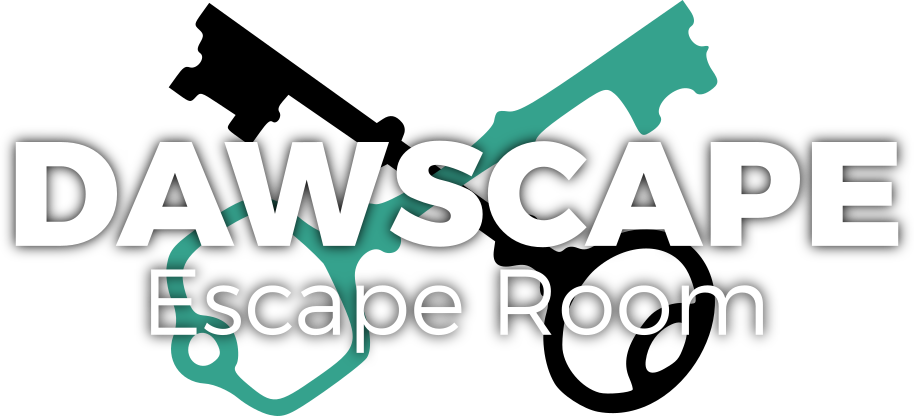
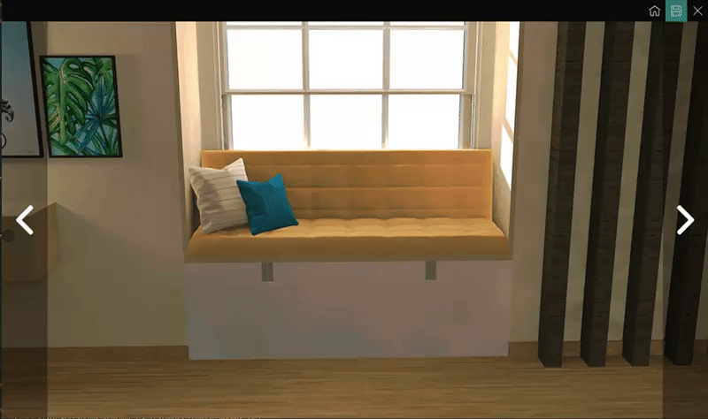

# Dawscape
Un escape room creado el 7/5/2019 con Java Swing, utilizando el patrón Modelo-Vista-Controlador para definir:

### Modelo

Guarda los datos de las escenas del juego, así como los objetos que el jugador encuentra. También define las variables aleatorias que se genera para cada partida. De esta forma, podemos guardar las partidas, exportarlas e importarlas

### Vista

Muestra al usuario la ventana de juego, cambiando las escenas por las que el jugador se mueve y enseñandole a través de una interfaz lo que ocurre.

Las escenas son sacadas de un modelo original creado por mi misma con SketchUp y renderizado con Indigo Renderer. Cada imagen tiene una escena con varios objetos, y esta cambia según los objetos que el usuario recoja o si abre ciertos elementos, como cajones o puertas.

### Controlador

Hace de conexión entre el modelo y la vista.

## ¿Cómo jugar Dawscape?
#### Directo
Debes tener instalado java en tu equipo -> [Instalador](https://www.java.com/es/download/)

Descarga el archivo Dawscape.jar y hazle doble click, el juego se abrirá ¡y ya podrás jugar!

#### Manual
Descarga todos los archivos del repositorio y compílalos con cualquier IDE con Java (Eclipse, NetBeans...).

Debes importar la librería zip4j para poder exportar e importar partidas. [Pulsa para descargar la librería](zip4j-1.3.2.jar)

I.E.S. Hermanos Machado | Programación | Irene Viñas | Mayo 2019
